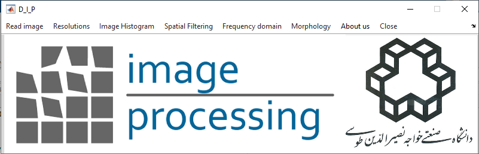

# Digital_Image_Processing

Basic Image Processing Software

This software has been developed to learn the basics of image processing.

# Prerequisites
At least MATLAB 2017

# Usage

In order to use this software, it is enough to run D_I_P.m file

# DataSet

you can use the basic images of http://www.imageprocessingplace.com/DIP-3E/dip3e_book_images_downloads.htm for learning about image processing basics.
